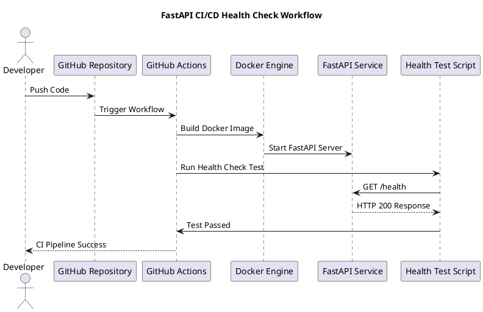

# FastAPI Health Check CI/CD

This project demonstrates **automated API health testing using FastAPI, Docker, and GitHub Actions**.  
It provides a simple health endpoint and a CI pipeline that validates the API status code during every push.

The goal is to simulate how **API health monitoring works in real CI/CD pipelines**.

---

# Workflow Diagram

