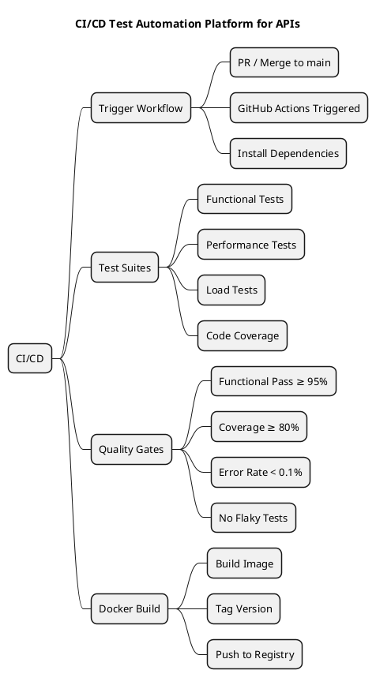
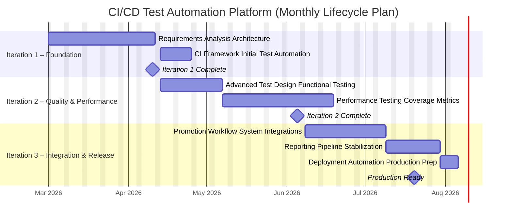
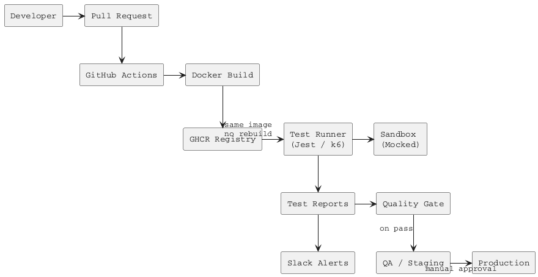

# CI/CD Test Automation Platform for APIs

---

## Project Description

This project delivers a **GitHub Actions-based test automation framework** that automatically validates APIs on every Pull Request, acting as a deployment gate before promoting Docker images to QA and Production environments. The pipeline enforces quality gates at each stage: Developer → Pull Request → Automated Tests → Docker Image Build → QA Environment → Production Deployment.

---


## Project Gantt Chart (3 Iterations)

### Project Summary

| Attribute | Detail |
|---|---|
| **Project Duration** | 20 weeks (2026-03-01 to 2026-07-20) |
| **Objective** | Deliver a CI/CD test automation platform for APIs with quality gates, automated PR validation, and production-ready pipeline controls. |
| **Key Deliverables** | Requirements sign-off · CI workflow with gates · Core API test suite · Performance baseline (P95/P99) · Dockerized execution and registry integration · Executive demo and handoff |




### Key Milestones by Iteration
- **Iteration 1 – Foundation:** CI skeleton operational, initial API tests running in GitHub Actions, Docker build/versioning in place, Iteration 1 review complete.
- **Iteration 2 – Quality & Performance:** Functional + edge-case suite expanded, performance/load tests integrated, coverage gates and metrics enforced, Iteration 2 review complete.
- **Iteration 3 – Integration & Release:** Promotion workflow and registry integration complete, reporting/dashboard delivered, full pipeline stabilized, production-ready gate achieved.

---

## Phase 1 – Scope & Success Criteria

### 1. Problem Statement
- Current API testing is fragmented, largely manual, and inconsistent across teams and services.
- CI/CD validation gaps allow regressions to pass through PRs without reliable automated gates.
- Manual or inconsistent regression testing introduces release risk, longer feedback cycles, and quality drift.
- Performance baselining and automated quality gates are needed to enforce objective release thresholds.

### 2. Project Scope

**In Scope**
- Automated functional API tests (core business flows)
- Edge case and data contract validation
- CI workflow skeleton and execution pipeline
- Performance benchmarks (P95/P99)
- Load and stress test scenarios
- Dockerized test execution
- CI quality gates integration
- Reporting and dashboards

**Out of Scope**
- UI automation
- Full end-to-end system testing across external dependencies
- Production performance testing
- Security penetration testing (unless explicitly added later)

### 3. Success Criteria (Measurable Outcomes)
- ≥80% functional API coverage for core services
- Test suite execution time under 10 minutes in CI
- <5% flaky test rate
- Automated performance baseline established (P95/P99)
- CI pipeline blocks merges on failed tests
- Fully dockerized and reproducible execution
- Reporting dashboard available to engineering stakeholders
- All Docker images use semantic versioning
- Build metadata traceable to commit SHA
- Release tags created on production promotion
- Continuous monitoring of Top 10 APIs
- P95 and P99 tracked per PR and per release
- Alert if deviation >10% from baseline
- Error rate <0.1% under normal load

### 4. Risks & Dependencies
- API instability during development
- Environment reliability issues
- CI runner capacity constraints
- Incomplete API documentation
- Test data management challenges

---

## Semantic Versioning

| Component | Description | Example |
|---|---|---|
| **Format** | MAJOR.MINOR.PATCH-BUILD | `1.4.2-156` |
| MAJOR | Breaking API change | — |
| MINOR | New backward-compatible feature | — |
| PATCH | Bug fix | — |
| BUILD | CI run number (auto-appended) | `${{ github.run_number }}` |

Version extracted from `package.json`; BUILD appended from CI run number. Example final tag: `1.3.0-245`.

---

## Final Architecture Flow

```
Developer
  ↓
PR Created
  ↓
Build + Tag Image (Semantic Version)
  ↓
Push to Registry
  ↓
Pull Same Image
  ↓
Run Tests (Functional + Coverage + Performance)
  ↓
Quality Gates
  ↓
Promote to QA
  ↓
Production Approval
```

---

## System Overview (Architecture Design)

The platform provides automated quality validation across three pipeline stages — PR Pipeline, Nightly Build, and Pre-Production Gate — acting as a deployment gate before any Docker image is promoted to QA or Production.

The core design principle is **single-image promotion**: a Docker image is built once on PR trigger, semantically versioned, and the identical tag is deployed through all environments without rebuilding. All test execution runs against this promoted image.

### Platform Architecture Flow

### Technology Stack

| Layer | Technology | Purpose |
|---|---|---|
| CI Orchestration | GitHub Actions | Workflow triggers, step execution, artifact management |
| Containerisation | Docker + GHCR | Image build, tagging, registry, and immutable promotion |
| Functional Testing | Supertest + Jest | HTTP API test suite, coverage reporting |
| Performance Testing | k6 | Load, stress, P95/P99 measurement with native threshold gates |
| Contract Testing | Spectral + Ajv | OpenAPI spec validation and runtime schema checks |
| Mocking | WireMock | HTTP stub server for Tier 1 external dependency isolation |
| Chaos Testing | Toxiproxy | Network fault injection for Pre-Prod resilience validation |
| Security Scanning | OWASP ZAP | Automated API security scan — scoped to Pre-Prod gate (pending confirmation) |
| Alerting | Slack webhook | Pipeline failure and SLA deviation notifications |

---

## Top 10 Critical APIs

### API Selection Criteria

APIs were selected based on four weighted criteria, applied across all platform services. No live traffic data was available; selection is based on business criticality modelling and platform domain knowledge.

| Criterion | Description | Weight |
|---|---|---|
| Business Criticality | Does failure directly impact revenue, user trust, or core product delivery? | 35% |
| Traffic Volume | Estimated call frequency across user sessions and integrations | 25% |
| Multi-Service Dependency | Is this API consumed by 2+ downstream services or microservices? | 20% |
| Historical Instability | Known past failures, incidents, or flakiness in production/staging | 20% |

### Top 10 Critical APIs — Selection Table

| # | Endpoint | Service | Criticality | P95 SLA | P99 SLA | Risk Level |
|---|---|---|---|---|---|---|
| 1 | `/auth/login` | Auth | Critical | < 200ms | < 300ms | High |
| 2 | `/auth/token/refresh` | Auth | Critical | < 150ms | < 250ms | High |
| 3 | `/qualix/analysis/submit` | Qualix Core | Critical | < 500ms | < 800ms | Critical |
| 4 | `/qualix/analysis/results/{id}` | Qualix Core | Critical | < 400ms | < 600ms | Critical |
| 5 | `/orders/create` | Order Service | High | < 400ms | < 600ms | High |
| 6 | `/orders/{id}/status` | Order Service | High | < 300ms | < 500ms | Medium |
| 7 | `/payments/initiate` | Payment Service | Critical | < 400ms | < 600ms | Critical |
| 8 | `/payments/{id}/verify` | Payment Service | Critical | < 300ms | < 500ms | Critical |
| 9 | `/inventory/commodities` | Inventory Service | High | < 350ms | < 500ms | Medium |
| 10 | `/reports/quality-summary` | Reporting Service | Medium | < 600ms | < 1000ms | Low |

---

## Test Strategy Architecture

### Test Type Definitions

- **Functional:** Validates request/response contracts, business logic, edge cases, and error handling. Runs on every PR.
- **Load:** Simulates expected concurrent user volume (e.g., 100–500 users) to verify P95/P99 under normal operational load.
- **Stress:** Pushes beyond normal load to identify breaking points, degradation thresholds, and recovery behavior.
- **Security:** Tests for injection attacks, authentication bypass, replay attacks, signature forgery, and OWASP API Top 10 vulnerabilities.
- **Chaos:** Simulates infrastructure failures — model timeouts, DB unavailability, network partitions — to validate resilience and fallback logic.
- **Contract:** Validates that API request/response schemas match the documented OpenAPI spec and any consumer SDK expectations (Pact or schema-based).

### Test Type Mapping per API

| Endpoint | Functional | Load | Stress | Security | Chaos | Contract | Notes |
|---|---|---|---|---|---|---|---|
| `/auth/login` | ✓ | ✓ | ✓ | ✓ | ✓ | ✓ | Full coverage — all 6 types |
| `/auth/token/refresh` | ✓ | ✓ | ✓ | ✓ | — | ✓ | No chaos — token refresh is atomic |
| `/qualix/analysis/submit` | ✓ | ✓ | ✓ | — | ✓ | ✓ | No security test — internal API; chaos for model failure |
| `/qualix/analysis/results/{id}` | ✓ | ✓ | — | — | ✓ | ✓ | Read-only; contract essential for consumer SDKs |
| `/orders/create` | ✓ | ✓ | ✓ | — | ✓ | ✓ | Chaos for idempotency failure simulation |
| `/orders/{id}/status` | ✓ | ✓ | — | — | — | ✓ | Light scope — read-only status endpoint |
| `/payments/initiate` | ✓ | ✓ | ✓ | ✓ | ✓ | ✓ | Full coverage — financial transaction API |
| `/payments/{id}/verify` | ✓ | — | — | ✓ | — | ✓ | Security + functional only — webhook verification |
| `/inventory/commodities` | ✓ | ✓ | ✓ | — | — | ✓ | Load test at 10k records; no chaos needed |
| `/reports/quality-summary` | ✓ | ✓ | — | — | — | — | Load only — async report; no contract needed |

---

## CI/CD Pipeline Architecture

### Pipeline Stage Definitions

| Stage | Trigger | Test Scope | Duration Target | Gate Action |
|---|---|---|---|---|
| PR Pipeline | Every PR to main/develop | Smoke + Functional + Contract + Light Perf (P95) | < 10 min | Block merge on failure |
| Nightly Build | Cron: 00:00 UTC | Load + Extended Functional + P95/P99 comparison | < 60 min | Slack alert to team |
| Pre-Prod Gate | Manual trigger before release | Stress + Chaos + Fault Injection + Security scan | < 3 hrs | Block production promotion |

### API-to-Pipeline Scope Matrix

| Endpoint | PR Pipeline | Nightly Build | Pre-Prod Gate |
|---|---|---|---|
| `/auth/login` | ✓ | ✓ | ✓ |
| `/auth/token/refresh` | ✓ | ✓ | ✓ |
| `/qualix/analysis/submit` | ✓ | ✓ | ✓ |
| `/qualix/analysis/results/{id}` | ✓ | ✓ | ✓ |
| `/orders/create` | ✓ | ✓ | ✓ |
| `/orders/{id}/status` | ✓ | — | — |
| `/payments/initiate` | ✓ | ✓ | ✓ |
| `/payments/{id}/verify` | ✓ | ✓ | ✓ |
| `/inventory/commodities` | ✓ | ✓ | — |
| `/reports/quality-summary` | — | ✓ | — |

### PR Pipeline — Stage Architecture

The PR pipeline is the primary quality gate. It must complete within 10 minutes to avoid impeding developer velocity.

| Step | Action | Tool |
|---|---|---|
| 1 | Checkout, install dependencies (`npm ci` + cache) | GitHub Actions |
| 2 | Extract version from `package.json`; append run number to form `MAJOR.MINOR.PATCH-BUILD` tag | Bash |
| 3 | Build Docker image; tag with semantic version | Docker |
| 4 | Push tagged image to GHCR (`ghcr.io/agnext/<service>:<version>`) | GHCR |
| 5 | Pull same image into CI test container | Docker |
| 6 | Smoke: health check + auth token issuance | Supertest |
| 7 | Functional: happy path + key edge cases per API in scope | Supertest + Jest |
| 8 | Contract: OpenAPI spec lint + response schema validation | Spectral + Ajv |
| 9 | Light performance: single-user P95 vs stored baseline (must be within 110%) | k6 |
| 10 | Quality gate evaluation; annotate PR with result | GitHub Actions |
| 11 | Upload test report, coverage, k6 summary as artifacts | actions/upload-artifact |

**PR Pipeline Test Scope Detail:**
- Smoke tests: health check + auth token issuance (< 30s)
- Functional tests: happy path + 3 key edge cases per API (< 5 min)
- Contract tests: OpenAPI schema validation for all endpoints in scope (< 2 min)
- Light performance: P95 check only — single-user baseline, must be within 110% of stored baseline (< 2 min)
- Total target: under 10 minutes wall-clock time per PR

### Nightly Build — Stage Architecture

- **Load:** 100–500 concurrent virtual users per critical API; 10-minute sustained ramp; P95/P99 captured per endpoint
- **Concurrency:** Simultaneous `/auth/token/refresh` + `/orders/create` + `/payments/initiate` to detect cross-service race conditions
- **Extended functional:** edge cases and boundary conditions excluded from PR pipeline for time
- **Baseline comparison:** compare P95/P99 against `/config/performance-baseline.json`; Slack alert on > 10% deviation

### Pre-Prod Gate — Stage Architecture

- **Stress:** Ramp to 150% of expected peak load; record degradation curve
- **Chaos (via Toxiproxy):** ML model timeout on `/qualix/analysis/submit`; gateway failure on `/payments/initiate`; DB unavailability on `/orders/create`
- **Security:** OWASP ZAP automated scan on `/auth` and `/payments` endpoints (scope pending confirmation)
- **Replay:** Production-like request sequences using sanitised fixture data
- **Fault injection:** Simulate network partition between services; validate circuit breakers

### Docker Image Strategy

Semantic version format: `MAJOR.MINOR.PATCH-BUILD` (e.g. `1.4.2-245`). The BUILD component is the GitHub Actions run number, appended automatically. Every image is labeled with the source commit SHA for full traceability. Tags are immutable — once pushed to GHCR, a tag is never overwritten.

Rollback is a manual GitHub Actions workflow that redeploys the previous stable tag from GHCR. Target rollback time is under 5 minutes. No code changes are required — rollback is purely a tag re-deployment.

---

## Dependency & Sandbox Architecture

### Three-Tier Isolation Model

| Tier | Stage | Isolation Strategy | Tools |
|---|---|---|---|
| Tier 1 — Fully Mocked | PR Pipeline | All external calls intercepted by WireMock stubs. No real network calls. Fast and deterministic. | WireMock, MSW |
| Tier 2 — Sandbox | Nightly Build | Real internal services using sandbox credentials and seeded test data. Payment gateway in test mode. | Docker Compose, sandbox credentials |
| Tier 3 — Near-Production | Pre-Prod Gate | All services as Dockerized production replicas. Sanitised fixture data. Gateway sandbox only. | Production-replica stack |

### External Dependency Map

| Endpoint | External Dependency | Mock / Stub Strategy | Sandbox Env Required | Test Data Lifecycle |
|---|---|---|---|---|
| `/auth/login` | Identity/JWT service, Redis session store | Mock JWT issuance; stub Redis with in-memory cache | Auth sandbox env with seeded users | Reset user tokens before each test run |
| `/auth/token/refresh` | Redis session store; token expiry logic | Stub Redis; simulate token expiry via time injection | Shared auth sandbox | Inject expired tokens as test fixtures |
| `/qualix/analysis/submit` | AI/ML model inference engine; camera/device input | Mock model response with predefined result sets | Isolated Qualix model sandbox (no GPU required) | Use commodity image fixtures; rotate per test run |
| `/qualix/analysis/results/{id}` | DB result store; async job queue | Seed DB with pre-computed results; stub job queue | CI test DB with seeded analysis records | Archive after run; regenerate for each suite |
| `/orders/create` | Inventory service, user account, idempotency service | Mock inventory availability; stub idempotency layer | Order sandbox with test users | Use unique idempotency keys per test; clean up post-run |
| `/orders/{id}/status` | Order DB, cache layer | Stub cache; seed order states (pending/confirmed/failed) | Shared order sandbox | Pre-seed 5 order states; no cleanup needed |
| `/payments/initiate` | External payment gateway (Razorpay/Stripe), order state | Use gateway sandbox mode; mock gateway timeout scenarios | Payment sandbox (gateway test credentials) | Create new transaction IDs per run; never reuse |
| `/payments/{id}/verify` | Gateway webhook, signature validation service | Replay pre-recorded webhook payloads; stub validator | Webhook listener in CI env | Use signed test payloads; rotate signing keys monthly |
| `/inventory/commodities` | Commodity DB (PostgreSQL) | No external dep; use seeded test DB | Shared inventory sandbox | Seed 10k commodity records; refresh weekly |
| `/reports/quality-summary` | Report DB, aggregation service | Stub aggregation; use pre-computed report fixtures | Reporting sandbox | Use fixed date-range fixtures; no live data |

### Mocking Constraints

- `/payments` endpoints must use gateway sandbox mode at all tiers — live credentials are never permitted in any CI stage
- Qualix ML model must return pre-defined fixture responses — deterministic outputs required for reliable test assertions
- Idempotency keys must be unique per test execution to prevent false duplicate-detection failures in `/orders` and `/payments`
- Database state must be seeded to a known baseline before each suite run; teardown scripts clean all test-generated records

### Performance Baseline Storage

P95 and P99 baselines are stored in `/config/performance-baseline.json` in the repository. The k6 pipeline step reads this file at runtime and computes deviation against live measurements. Baseline updates require a dedicated PR reviewed by a senior engineer — direct commits to `/config/` are blocked via branch protection. Updates are only proposed after at least five consecutive stable nightly runs.

### Key Principles for Data & State Management

- All external dependencies (payment gateways, ML model servers) must have a sandbox/mock equivalent before CI tests can run against them
- Test data must be deterministic — no dependency on live production data in CI or nightly pipelines
- Idempotency keys must be unique per test execution to prevent false duplicate-detection failures
- Database state must be seeded to a known baseline before each test suite run; teardown scripts must clean all test-created records
- `/payments` endpoints must NEVER run against live payment credentials — gateway sandbox mode is mandatory
- The Qualix ML model sandbox must return pre-defined fixture responses to ensure deterministic test outcomes

---

## Risk Analysis & Prioritisation

### Risk Scoring Formula

**Risk Score = Impact (1–5) × Probability (1–5)**

| Score Range | Classification | Action Required |
|---|---|---|
| 16 – 25 | 🔴 Critical | Build automated test immediately; block PR on failure |
| 9 – 15 | 🟠 High | Automate in Iteration 1; include in nightly suite |
| 4 – 8 | ⚪ Medium | Automate in Iteration 2; monitor nightly |
| 1 – 3 | 🟢 Low | Manual or exploratory testing; low automation priority |

### Risk Register

| Risk ID | Endpoint | Primary Risk | Impact | Probability | Score | Classification | Mitigation Summary |
|---|---|---|---|---|---|---|---|
| R-01 | `/auth/login` | Token service downtime / expired certs | 5 | 4 | **20** | 🔴 Critical | Circuit breaker + retry logic; cert expiry monitoring 30d in advance |
| R-02 | `/auth/token/refresh` | Race conditions under concurrent refresh | 4 | 3 | **12** | 🟠 High | Mutex/locking; concurrent session tests (200+ users) |
| R-03 | `/qualix/analysis/submit` | AI/ML model latency spikes under load | 5 | 4 | **20** | 🔴 Critical | Async job queue + 5s timeout gate; P99 alert if > 1s |
| R-04 | `/qualix/analysis/results/{id}` | Long-polling abuse / DB read bottleneck | 4 | 3 | **12** | 🟠 High | Rate-limit polling; caching layer for repeated fetches |
| R-05 | `/orders/create` | Duplicate order on retry (idempotency failure) | 4 | 3 | **12** | 🟠 High | Idempotency key enforcement; retry storm simulation |
| R-06 | `/orders/{id}/status` | Stale cache returning outdated order state | 3 | 2 | **6** | ⚪ Medium | TTL enforcement; cache invalidation integration tests |
| R-07 | `/payments/initiate` | Gateway timeout / partial payment state | 5 | 4 | **20** | 🔴 Critical | Distributed transaction checks; gateway timeout tests at 3s/5s/10s |
| R-08 | `/payments/{id}/verify` | Webhook replay attacks / signature bypass | 5 | 4 | **20** | 🔴 Critical | Signature validation tests; nonce + timestamp replay prevention |
| R-09 | `/inventory/commodities` | Slow query on large commodity dataset (10k+ rows) | 3 | 2 | **6** | ⚪ Medium | Index optimization; pagination enforcement; load test at 10k records |
| R-10 | `/reports/quality-summary` | Timeout on large date-range queries | 2 | 2 | **4** | ⚪ Medium | Async report generation; max date range enforcement; pagination |

### Iteration Planning by Risk Score

- **Score 16–25 (Critical — 4 APIs):** `/auth/login`, `/qualix/analysis/submit`, `/payments/initiate`, `/payments/{id}/verify` → automated tests built in Iteration 1, Sprint 1
- **Score 9–15 (High — 3 APIs):** `/auth/token/refresh`, `/qualix/analysis/results/{id}`, `/orders/create` → automate in Iteration 1, Sprint 2
- **Score 4–8 (Medium — 3 APIs):** `/orders/{id}/status`, `/inventory/commodities`, `/reports/quality-summary` → automate in Iteration 2
- **Effort distribution:** 70% to Critical/High-scored APIs, 30% to Medium

---

## Monitoring & SLA Strategy

### SLA Targets

| Endpoint | P95 Target | P99 Target | Error Rate Target |
|---|---|---|---|
| `/auth/login` | < 200ms | < 300ms | < 0.1% |
| `/auth/token/refresh` | < 150ms | < 250ms | < 0.1% |
| `/qualix/analysis/submit` | < 500ms | < 800ms | < 0.1% |
| `/qualix/analysis/results/{id}` | < 400ms | < 600ms | < 0.1% |
| `/orders/create` | < 400ms | < 600ms | < 0.1% |
| `/orders/{id}/status` | < 300ms | < 500ms | < 0.1% |
| `/payments/initiate` | < 400ms | < 600ms | < 0.1% |
| `/payments/{id}/verify` | < 300ms | < 500ms | < 0.1% |
| `/inventory/commodities` | < 350ms | < 500ms | < 0.1% |
| `/reports/quality-summary` | < 600ms | < 1000ms | < 0.1% |

### Alert Conditions

| Condition | Threshold | Action |
|---|---|---|
| P95/P99 deviation | > 10% above baseline | Warning — Slack #qa-alerts; PR may still merge |
| P95/P99 deviation (severe) | > 25% above baseline | Hard block — pipeline halts; PR cannot merge |
| Error rate breach | ≥ 0.1% on any Critical/High API | Immediate block + Slack #incidents notification |
| Critical API SLA breach | P95 exceeds endpoint SLA | Slack notification to team; flag for investigation |
| Nightly build failure | Any test failure in nightly run | Slack #qa-alerts notification |
| Flaky test rate | > 5% of suite executions | Slack notification; test quarantined pending investigation |

### Quality Gates Summary

| Gate | Threshold | Stage | On Breach |
|---|---|---|---|
| Critical test pass rate | 100% of critical cases; non-critical reviewed before merge | PR + Nightly | Block merge / alert |
| Code coverage | ≥ 80% line + branch | PR | Block merge |
| P95 response time | Within 110% of `/config/performance-baseline.json` | PR | Block merge |
| P95/P99 deviation | > 10% warning; > 25% hard block | Nightly + Pre-Prod | Alert / block promotion |
| API error rate | < 0.1% under normal load | All stages | Block (Critical/High APIs) |
| Docker image tag | Semantic version + commit SHA label present | PR | Block merge |
| Contract compliance | Zero schema violations vs OpenAPI spec | PR | Block merge |
| Flaky test rate | < 5% of suite executions | PR + Nightly | Quarantine; escalate if > 5 days |

---

## Repository Structure

| Path | Contents |
|---|---|
| `.github/workflows/` | `pr.yml`, `nightly.yml`, `preprod.yml`, `rollback.yml` |
| `tests/functional/` | Supertest suites organised by service (`auth/`, `qualix/`, `orders/`, `payments/`) |
| `tests/contract/` | Spectral rules, Ajv schemas, Pact consumer tests (Phase 2) |
| `tests/performance/` | k6 load and stress scripts per endpoint |
| `tests/chaos/` | Toxiproxy configs and fault injection scenarios |
| `mocks/` | WireMock stub mappings for all mocked external services |
| `fixtures/` | SQL seed scripts, JSON fixture payloads per endpoint |
| `docker/` | Dockerfiles, Docker Compose for sandbox environments |
| `config/` | `performance-baseline.json`, SLA thresholds, environment configs |
| `scripts/` | DB seed/teardown utilities, baseline comparison helpers |
