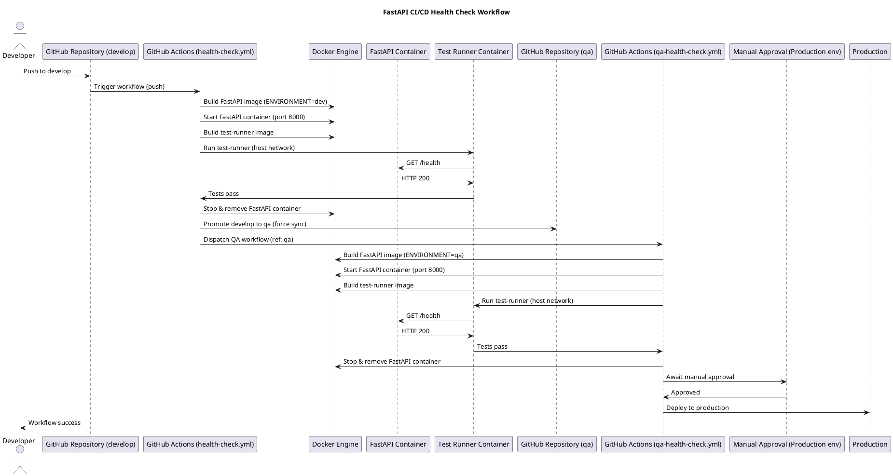

# FastAPI Health Check CI/CD Pipeline

Automated API health testing with Docker and GitHub Actions demonstrating real-world CI/CD practices.

---

##  What This Does

Tests a FastAPI health endpoint automatically through **three environments** (Dev → QA → Production) with manual approval before production.

---

##  Project Structure

```
testing/
├── .github/workflows/
│   ├── health-check.yml       # Dev pipeline (auto on push to develop)
│   └── qa-health-check.yml    # QA/Prod pipeline (manual dispatch)
├── health_check/
│   ├── app/
│   │   ├── main.py           # FastAPI app with /health endpoint
│   │   └── config.py         # Environment config loader
│   ├── env/
│   │   ├── dev.env           # Development config
│   │   ├── qa.env            # QA config
│   │   └── prod.env          # Production config
│   ├── Dockerfile            # Application container
│   └── requirements.txt
└── test_runner/
    ├── runner.py             # HTTP health check test
    ├── Dockerfile            # Test container
    └── requirements.txt
```

---

##  Workflow Diagram



## Pipeline Flow Summary

```
Push to develop
      ↓
Build Dev Image → Start Container → Run Tests
      ↓ (pass)
Promote to QA Branch
      ↓
Build QA Image → Start Container → Run Tests
      ↓ (pass)
⏸️  Manual Approval Gate
      ↓ (approved)
Deploy to Production 
```

---

##  Quick Start

### Run Locally
```bash
cd health_check
docker build --build-arg ENVIRONMENT=dev -t fastapi-health:dev .
docker run -p 8000:8000 fastapi-health:dev

# Test the endpoint
curl http://localhost:8000/health
# Response: {"status": "ok", "environment": "dev"}
```

### Trigger CI Pipeline
```bash
git push origin develop  # Auto-triggers dev pipeline
```

### Approve Production Deployment
1. Go to **Actions** tab in GitHub
2. Find the paused QA workflow
3. Click **Review deployments** → Approve

---

## Key Components

| Component | Purpose | Details |
|-----------|---------|---------|
| **FastAPI App** | Health endpoint | Returns `{"status": "ok", "environment": "<env>"}` |
| **Test Runner** | Black-box testing | Validates `/health` returns HTTP 200 |
| **Docker** | Containerization | Consistent builds across all environments |
| **GitHub Actions** | CI/CD Automation | Builds, tests, and promotes code |
| **Environment Files** | Configuration | Separate configs for dev/qa/prod |

---

##  Docker Architecture

```
┌─ GitHub Actions Runner ──────────┐
│                                   │
│  FastAPI Container (port 8000)   │
│         ↑                         │
│         │ HTTP GET /health        │
│         │                         │
│  Test Runner (--network host)    │
└───────────────────────────────────┘
```

**Why `--network host`?** Allows test container to access FastAPI on `localhost:8000`

---

##  Workflow Details

### **Dev Pipeline** (health-check.yml)
- **Trigger**: Push to `develop` branch
- **Steps**:
  1. Build FastAPI Docker image with `ENVIRONMENT=dev`
  2. Start container on port 8000
  3. Build and run test runner
  4. Cleanup containers (always runs even on failure)
  5. Promote code to `qa` branch
  6. Trigger QA workflow via GitHub API

### **QA/Prod Pipeline** (qa-health-check.yml)
- **Trigger**: Manual dispatch (called by dev pipeline)
- **Jobs**:
  1. **test-health-qa**: Build & test with QA config
  2. **manual-approval**: Wait for human approval (uses GitHub `environment: production`)
  3. **deploy-production**: Deploy after approval

---

##  DevOps Concepts

 **GitOps** - Branch-based environment promotion  
 **Containerization** - Docker for consistent deployments  
 **Automated Testing** - CI runs tests on every push  
 **Progressive Delivery** - Staged rollout with approval gates  
 **Environment Management** - Config separation via `.env` files  
 **Infrastructure as Code** - GitHub Actions workflows  

---

## 🔧 Environment Configuration

Configs are injected at **build time** using Docker `ARG`:

```yaml
# dev.env
ENVIRONMENT=dev
API_KEY=dev123
BASE_URL=https://dev.api

# qa.env
ENVIRONMENT=qa
API_KEY=qa_key
BASE_URL=https://qa.api
```

---

## Best Practices Implemented

1. **Always cleanup**: `if: always()` ensures containers are removed
2. **Manual gates**: Production requires human approval
3. **Separate configs**: Never share credentials across environments
4. **Black-box testing**: Test runner is independent of app code
5. **Force push to QA**: Ensures QA branch exactly matches develop
6. **Minimal permissions**: Workflows only have required permissions

---

## Testing

The test runner performs a simple health check:
```python
response = requests.get("http://localhost:8000/health")
# Expects: status_code == 200
```

**Pass**: Pipeline continues  
**Fail**: Pipeline stops immediately

---

**Questions?** Check the workflow logs in GitHub Actions!
