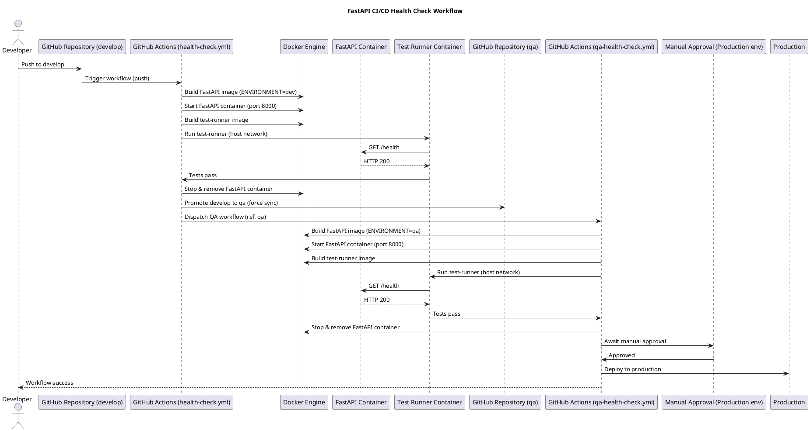

# FastAPI Health Check CI/CD

This project demonstrates **automated API health testing using FastAPI, Docker, and GitHub Actions**.  
It provides a simple health endpoint and a CI pipeline that validates the API status code during every push.

The goal is to simulate how **API health monitoring works in real CI/CD pipelines**.

---

## Workflow Diagram

## Workflow

1. **Developer push**
   The workflow starts when a developer pushes code to the `develop` branch.  
   This automatically triggers the GitHub Actions CI pipeline.

2. **CI pipeline (development environment)**
   The pipeline builds a Docker image for the FastAPI application using the development configuration.  
   Then it starts the FastAPI container on port `8000`.

3. **Automated testing**
   After the application container starts, a separate test-runner container is executed.  
   This container performs a black-box health check by calling the `/health` endpoint.  
   If the API returns HTTP `200`, the tests pass and the pipeline continues.

4. **Container cleanup**
   Once the tests complete, the pipeline stops and removes the FastAPI container to keep the environment clean.

5. **Automatic promotion to QA**
   After successful testing in development, the pipeline automatically promotes the code from the `develop` branch to the `qa` branch.  
   This promotion triggers the QA pipeline.

6. **QA pipeline**
   In the QA stage, the application is rebuilt using the QA environment configuration.  
   The container starts again and the same test-runner container executes the health check tests to validate the QA build.

7. **Manual approval gate**
   Once the QA tests pass, the pipeline pauses and requires manual approval before deploying to production.  
   This approval step ensures that nothing reaches production without human validation.

8. **Production deployment**
   After approval, the pipeline proceeds to the production deployment stage.
