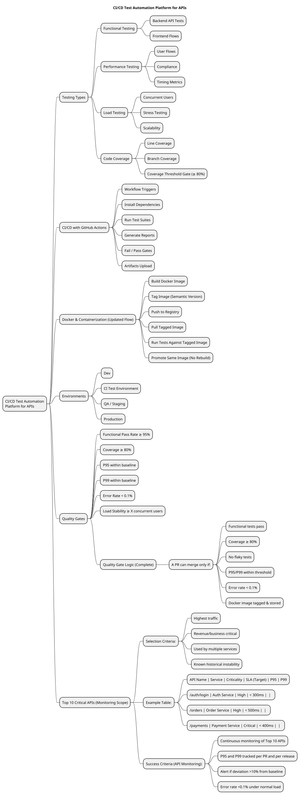
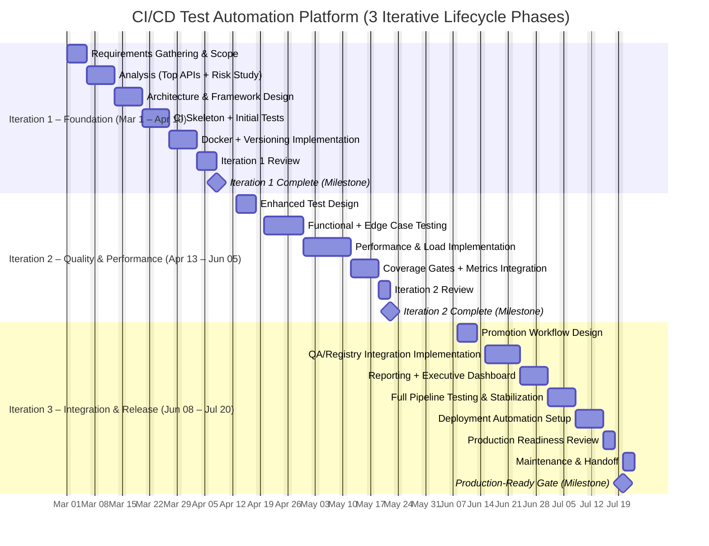

# CI/CD Test Automation Platform for APIs

## Project Description

This project delivers a **GitHub Actions-based test automation framework** that automatically validates APIs on every Pull Request, acting as a deployment gate before promoting Docker images to QA and Production environments. The pipeline enforces quality gates at each stage: Developer → Pull Request → Automated Tests → Docker Image Build → QA Environment → Production Deployment.

---

## Mindmap

---

# CI/CD Test Automation Platform for APIs

## Project Gantt Chart (3 Iterations)

---

### Project Summary

| Attribute | Detail |
|---|---|
| **Project Duration** | 20 weeks (2026-03-01 to 2026-07-20) |
| **Objective** | Deliver a CI/CD test automation platform for APIs with quality gates, automated PR validation, and production-ready pipeline controls. |
| **Key Deliverables** | Requirements sign-off · CI workflow with gates · Core API test suite · Performance baseline (P95/P99) · Dockerized execution and registry integration · Executive demo and handoff |

---

### Key Milestones by Iteration
- **Iteration 1 – Foundation:** CI skeleton operational, initial API tests running in GitHub Actions, Docker build/versioning in place, Iteration 1 review complete.
- **Iteration 2 – Quality & Performance:** Functional + edge-case suite expanded, performance/load tests integrated, coverage gates and metrics enforced, Iteration 2 review complete.
- **Iteration 3 – Integration & Release:** Promotion workflow and registry integration complete, reporting/dashboard delivered, full pipeline stabilized, production-ready gate achieved.

# Phase 1 – Scope & Success Criteria

## 1. Problem Statement
- Current API testing is fragmented, largely manual, and inconsistent across teams and services.
- CI/CD validation gaps allow regressions to pass through PRs without reliable automated gates.
- Manual or inconsistent regression testing introduces release risk, longer feedback cycles, and quality drift.
- Performance baselining and automated quality gates are needed to enforce objective release thresholds.

## 2. Project Scope

### In Scope
- Automated functional API tests (core business flows)
- Edge case and data contract validation
- CI workflow skeleton and execution pipeline
- Performance benchmarks (P95/P99)
- Load and stress test scenarios
- Dockerized test execution
- CI quality gates integration
- Reporting and dashboards

### Out of Scope
- UI automation
- Full end-to-end system testing across external dependencies
- Production performance testing
- Security penetration testing (unless explicitly added later)

## 3. Success Criteria (Measurable Outcomes)
- ≥80% functional API coverage for core services
- Test suite execution time under 10 minutes in CI
- <5% flaky test rate
- Automated performance baseline established (P95/P99)
- CI pipeline blocks merges on failed tests
- Fully dockerized and reproducible execution
- Reporting dashboard available to engineering stakeholders
- All Docker images use semantic versioning
- Build metadata traceable to commit SHA
- Release tags created on production promotion
- Continuous monitoring of Top 10 APIs
- P95 and P99 tracked per PR and per release
- Alert if deviation >10% from baseline
- Error rate <0.1% under normal load

# Semantic Versioning
- Version Format: MAJOR.MINOR.PATCH-BUILD (e.g., 1.4.2-156)
- MAJOR: Breaking API change
- MINOR: New backward-compatible feature
- PATCH: Bug fix
- BUILD: CI run number
- Extract version from package.json or file, append ${{ github.run_number }}
- Example final tag: 1.3.0-245

# Final Architecture Flow
Developer
  ↓
PR Created
  ↓
Build + Tag Image (Semantic Version)
  ↓
Push to Registry
  ↓
Pull Same Image
  ↓
Run Tests (Functional + Coverage + Performance)
  ↓
Quality Gates
  ↓
Promote to QA
  ↓
Production Approval

## 4. Risks & Dependencies
- API instability during development
- Environment reliability issues
- CI runner capacity constraints
- Incomplete API documentation
- Test data management challenges
